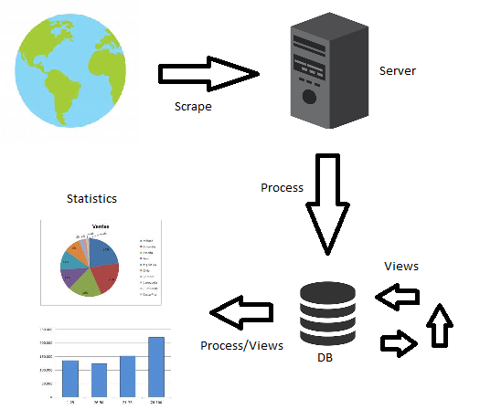

OCDS Kingfisher
===============

Kingfisher comprises three tools, which integrate to form an OCDS data pipeline:

- `kingfisher-collect <https://kingfisher-collect.readthedocs.io/en/latest/>`_ , for downloading data from public sources of OCDS data
- `kingfisher-process <https://kingfisher-process.readthedocs.io/en/latest/>`_, for storing OCDS data, and performing operations on it, including transformation and validation. 
- `kingfisher-views <https://kingfisher-views.readthedocs.io/en/latest/>`_, a suite of queries that can be used to meaningfully interpret OCDS data sets

In the model you can see "Kingfisher Scrape" retrieves the data and stores it in a server, then "Kingfisher Process" puts them in the database in JSON format and also makes transformations, and "Kingfisher views" transform the jsons into their tabulated format to finally use them for generate the graphics.

If you work at/with OCP, see the [Kingfisher User Guide](https://ocdsdeploy.readthedocs.io/en/latest/use/kingfisher.html).

.. toctree::

   vagrant.rst
