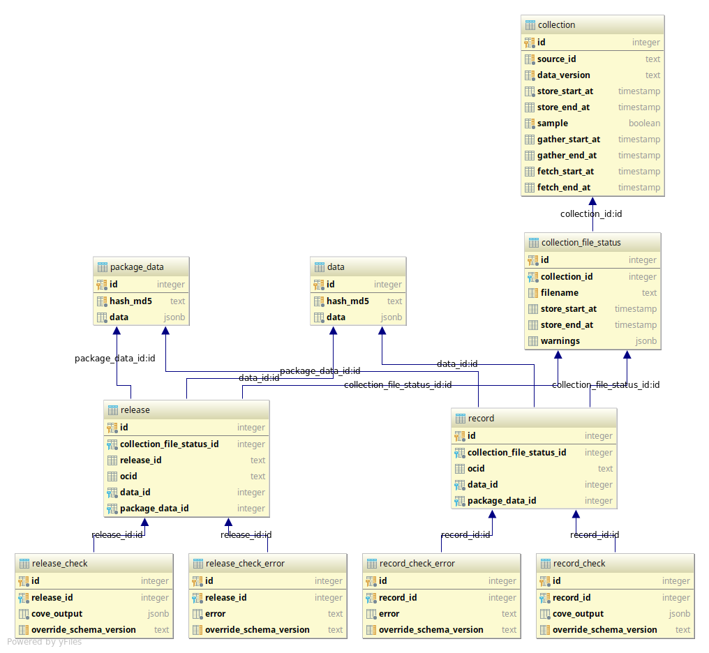

Requirements and Install
========================

Requirements
------------

Requirements:

- python v3.5 or higher
- Postgresql v10 or higher

Installation
------------

Set up a venv and install requirements:

.. code-block:: shell-session

    virtualenv -p python3 .ve
    source .ve/bin/activate
    pip install -r requirements.txt
    pip install -e .

Database
------------

You need to create a UTF8 Postgresql database and create a user with write access.

Once you have created the database, you need to configure the tool to connect to the database.

You can see one way of doing that in the example below, but for other options see :doc:`config`.

You also have to run a command to create the tables in database.

You can see the command in the example below, but for more on that see :doc:`cli-upgrade-database`.

Example of creating an database user, database and setting up the schema:

.. code-block:: shell-session

    sudo -u postgres createuser ocdskingfisher --pwprompt
    sudo -u postgres createdb ocdskingfisher -O ocdskingfisher --encoding UTF8 --template template0 --lc-collate en_US.UTF-8 --lc-ctype en_US.UTF-8
    export DB_URI='postgres://ocdskingfisher:PASSWORD YOU CHOSE@localhost/ocdskingfisher'
    python ocdskingfisher-cli upgrade-database

The generated data base will have this tables:

Where:

- Collection: this table contains all the results of run commands that pass the storage stage.
                - source_id: the name of the collection that was run, for example 'canada_buyandsell'
                - data_version: the date and time when the run command was executed
                - store_start_at: the date and time when the store stage begun
                - store_end_at: the data and time when the store stage end
                - sample: a mark that indicates if (false) the collection has all the available data or just a sample of it (true)
                - gather_start_at: the date and time when the gather stage begun
                - gather_end_at: the data and time when the gather stage end
                - fetch_start_at: the date and time when the fetch stage begun
                - fetch_end_at: the data and time when the fetch stage end
- Collection File Status: this table contains the information about each file downloaded from a collection.
                - filename: the name of the file that was downloaded
                - store_start_at: the date and time when the store of this file begun
                - store_end_at: the data and time when the store of this file end
                - warnings: a text that indicates any warnings in the process of save the files, for example encoding issues
- Package Data: this table contains the meta data information that is included in a release or record package.
                - hash_md5: a md5 hash to know if the data changes
                - data: the `meta data <http://standard.open-contracting.org/latest/en/schema/reference/#package-metadata>`_ in jsonb format.
- Record: this table contains the ocid and relations with other tables from the downloaded records
- Release: this table contains the ocid, release id and relations with other tables from the downloaded releases
- Data: this table contains the actual data from the releases package and record package. Each row contain a hash and a data column that is
a jsonb with a release, that comes from a record: from its releases list or compiledRelease field, or from a release package.
- Record check and Release check: this table contains the result of running the `CoVe <https://github.com/OpenDataServices/cove>`_
validation to a release or record package in the cove_output column.

- Record an Release check error: register any error happened in the check stage